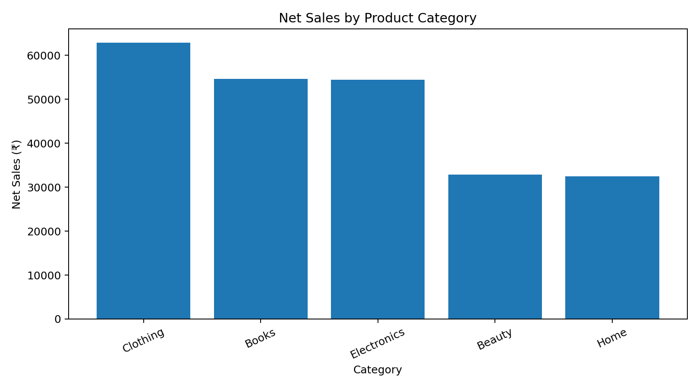
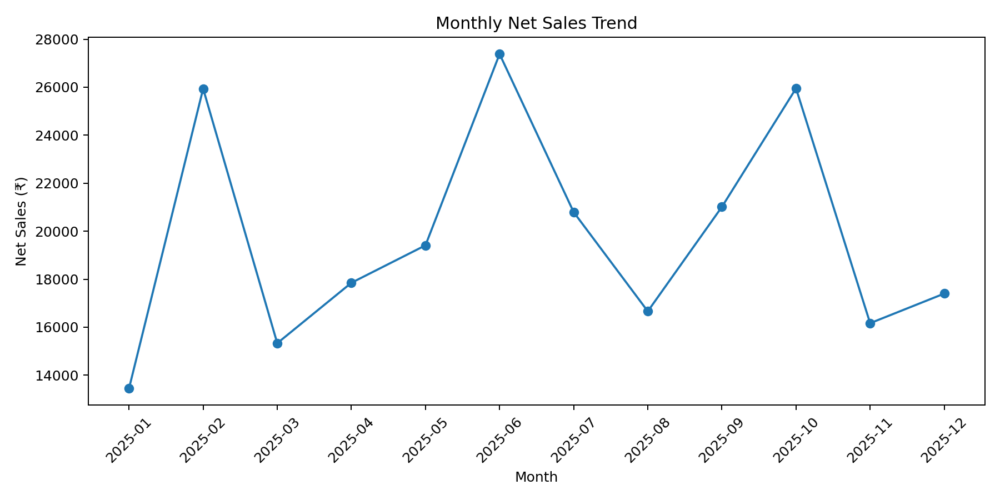
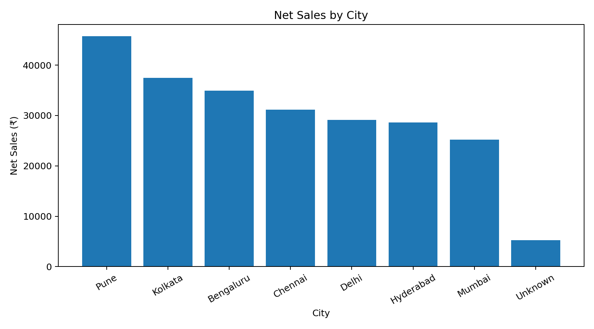

<div align="center">

# E-commerce Data Cleaning & Visualization

### Transforming messy sales data into reliable business insights using Python


</div>

---

## Project Overview

This project demonstrates a complete data-cleaning and visualization workflow using a deliberately messy e-commerce sales dataset.

The raw dataset contained:

* Missing values
* Duplicate records
* Inconsistent category and city names
* Impossible customer ages
* Extreme numerical outliers
* Unprocessed sales information

The goal was to transform the raw data into a clean, structured dataset and communicate meaningful business insights through visualizations.

---

## Dataset Summary

| Metric                    | Result |
| ------------------------- | -----: |
| Raw records               |    332 |
| Clean records             |    320 |
| Duplicate records removed |     12 |
| Final columns             |     14 |
| Visualizations created    |      4 |

---

## Data Cleaning Process

The following cleaning steps were performed:

* Removed exact duplicate records
* Standardized city, category, and payment-method labels
* Filled missing ages and ratings using median values
* Filled missing prices using category-level medians
* Replaced impossible ages with the median valid age
* Treated price and quantity outliers using the IQR method
* Converted order dates into datetime format
* Created new analytical features

---

## Feature Engineering

The following features were created:

| Feature       | Description                       |
| ------------- | --------------------------------- |
| `Gross_Sales` | Quantity multiplied by unit price |
| `Net_Sales`   | Gross sales after discount        |
| `Order_Month` | Month extracted from order date   |
| `Age_Group`   | Customers grouped into age ranges |

---

## Key Findings

* **Total net sales:** ₹237,342.47
* **Average order value:** ₹741.70
* **Average customer rating:** 3.72/5
* **Highest-sales category:** Clothing
* **Highest-sales city:** Pune
* **Highest-sales month:** June 2025

---

## Visual Analysis

### Net Sales by Product Category



Clothing generated the highest net sales among the product categories in the dataset.

---

### Monthly Sales Trend


The monthly sales pattern reveals changes in performance throughout the year, with June recording the highest sales.

---

### Net Sales by City



Pune emerged as the strongest city market based on total net sales.

---

### Unit Price Distribution



The distribution shows the range of product prices after extreme outliers were treated using the IQR method.

---

## Data Story

The cleaned dataset shows that Clothing was the strongest-performing category, while Pune contributed the highest city-level sales.

Customer ratings were generally positive, with an average rating of 3.72 out of 5.

The monthly sales trend also revealed seasonal variation, which could help businesses improve inventory planning, marketing timing, and category-level sales strategies.

---

## Project Files

| File                                        | Purpose                            |
| ------------------------------------------- | ---------------------------------- |
| `raw_ecommerce_sales.csv`                   | Original messy dataset             |
| `cleaned_ecommerce_sales.csv`               | Cleaned and enriched dataset       |
| `Data_Cleaning_Visualization_Project.ipynb` | Step-by-step analysis notebook     |
| `data_cleaning_visualization.py`            | Reusable Python script             |
| `ecommerce_data_project.xlsx`               | Excel dashboard and summary tables |

---

## Technologies Used

* Python
* Pandas
* Matplotlib
* Jupyter Notebook
* Microsoft Excel

---

## Skills Demonstrated

* Data preprocessing
* Missing-value handling
* Duplicate removal
* Text standardization
* Outlier detection using IQR
* Feature engineering
* Exploratory data analysis
* Data aggregation
* Data visualization
* Business insight generation
* Data storytelling

---

## How to Run the Project

Install the required libraries:

```bash
pip install pandas matplotlib jupyter
```

Run the Python script:

```bash
python data_cleaning_visualization.py
```

Or open the notebook:

```text
Data_Cleaning_Visualization_Project.ipynb
```

---

<div align="center">

### Created by Titiksha Pattanayak

Exploring Data Science, Artificial Intelligence, Cloud Computing and Digital Systems

</div>
